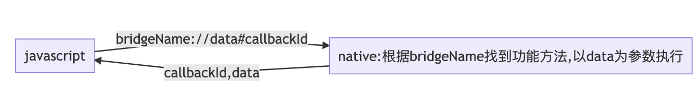

# JSBridge通信过程

JSBridge 就是JavaScript(H5)与Native通信的桥梁，在H5开发中经常有操作Native的需求，Native(安卓 ISO window...)过JSBridge与Native通信，赋予了JavaScript操作Native的能力，同时也给了Native调用JavaScript的能力。

## 通信方式
### 1 原生注入API法

通过 WebView 提供的接口，向 JavaScript 的 Context（window）中注入对象或者方法
```js
// 前端调用方式
window.postBridge(message); 
```
### 2 拦截Url Scheme 

web 端通过某种方式（例如 iframe.src）发送 URL Scheme 请求，之后 Native 拦截到请求并根据 URL SCHEME（包括所带的参数）进行相关操作。 

缺点：iframe.src 发送 URL scheme 会有 url 长度的隐患。 创建请求，需要一定的耗时，比注入 API 的方式调用同样的功能，耗时会较长。



```js
function loadURL(url) { 
    var iFrame; iFrame = document.createElement("iframe");
    iFrame.setAttribute("src", url); iFrame.setAttribute("style", "display:none;"); 
    iFrame.setAttribute("height", "0px"); iFrame.setAttribute("width", "0px"); 
    iFrame.setAttribute("frameborder", "0");
    document.body.appendChild(iFrame); 
    // 发起请求后这个iFrame就没用了，所以把它从dom上移除掉 
    iFrame.parentNode.removeChild(iFrame); iFrame = null; 
} 
loadURL("esales://ShowPicker"); 
```

## android端开启bridge关键代码

```java
@SuppressLint("SetJavaScriptEnabled")
    @Override
    protected void onCreate(Bundle savedInstanceState) {
        super.onCreate(savedInstanceState);
        setContentView(R.layout.activity_main);
        webView = findViewById(R.id.loginWebView);
        webView.getSettings().setJavaScriptEnabled(true);
        // JS注入,此时AppBridge就代表了当前bridge对象，可以通过 AppBridge 访问到native中的方法。
        webView.addJavascriptInterface(new InjectNativeObject(this), "AppBridge");
        webView.loadUrl(String.format("http://%s:3000/login_webview", host)); // 加载Webview
    }

class InjectNativeObject{

    public InjectNativeObject(){
    
    }
    //安全机制注解，防止攻击者去篡改宿主应用程序
    @JavascriptInterface
    public void showToast(Object obj){
    }
}

通过 AppBridge对象，就可以调用到 showToast()方法.
```


## 在前端bridge调用

- 第一种就是 Native内嵌的H5可以获取到一个全局对象AppBridge。通过该对象就可以调用到Native上对象绑定的方法。
- 第二种即 **<font color="red"> Android端通过shouldOverrideUrlLoading  </font>** 拦截URL Schema

```javascript
// 注入的对象
window.AppBridge = AppBridge || {}; 

// 登录按钮点击，调用注入的openNewPage方法，并传入相应的值
loginButton.addEventListener("click", function (e) {
    window.AppBridge.showToast('我调用了bridge');
}, false);
```


## 拦截URL Schema

H5端通过iframe.src或location.href发送Url Schema请求，之后Native（Android端通过shouldOverrideUrlLoading()方法）拦截到请求的Url Schema（包括参数等）进行相应的操作。

H5通过发送一个url请求，Native拦截到请求。客户端可以通过schema来区分是JSBridge调用还是普通的https请求从而做不同的处理。

url可以是：

- http:www.baidu.com 正常的url请求 交给webview对象处理。
- AppBridge://showToast/?data={} bridge请求，通过AppBridge调用native的方法。


