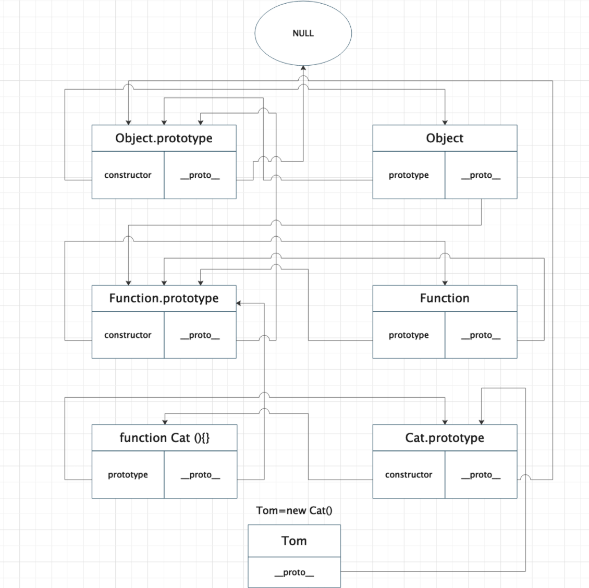

# 原型链



```
function Cat (name) {
    this.name = name;
}

Cat.prototype.color = 'white';

var cat1 = new Cat('Tom');
console.log(cat1)//{name:'tom'}
var cat2 = new Cat('Mark');
console.log(cat2)//{name:'Mark'}
cat1.color = 'black';
console.log(cat1,cat2)//{name:'tom',color:'black'}{name:'tom'}
console.log(cat1.color)//black
console.log(Cat.color)//函数无法直接获取属性
```

## 什么是原型链？

访问一个对象的属性时，先在基本属性中查找，如果没有，再沿着 proto 这条链向上找，这条链便是原型链。

原型链解决的问题，多个实例共享属性方法的问题，减少开辟内存空间。

## 【_proto_】与 prototype（显式原型）

- 所有对象都有【_proto_】隐式原型,而只有函数对象才有 prototype。
- 函数是一个特殊的对象，当一个函数被创建后，这个函数会附带一个属性 prototype，prototype 代表函数的原型。

- prototype 对象有两个属性，constructor 和 【_proto_】。
- constructor 这个属性指创建原型的函数，它指向函数本身，而【_proto_】指向原型对象。

## constructor

NothingSpecial 只是一个普通的函数.当使用 new 调用时，就会构造一个对象并赋值给 a,此时 NothingSpecial(){}是构造函数。但 NothingSpecial 本身并不是构造函数。

```$xslt
function Foo() {
  }
  let a = new Foo(); // true
  console.log(a);
```

- Foo.prototype.constructor == a.constructor == a[__proto__]constructor == Foo

```$xslt
function NothingSpecial() { console.log( "Don't mind me!" );
}
var a = new NothingSpecial();
// "Don't mind me!" a; // {}

```


```angular2html
var F = function(){};
Object.prototype.a = function(){};
Function.prototype.b = function(){};
var f = new F();
// f 能取到a,b吗？原理是什么？

f.__proto__ === F.prototype  ===> F.prototype__proto__ === Object.prototype ===> Object.prototype.__proto__ === null
所以 f可以找到a

F.__proto__ === Function.prototype ===> Function.prototype.__proto === Object.prototype ===> Object.prototype.__proto__ === null 
所以F既能找到b也能找到a

```


## 函数对象 vs 普通对象

```angular2html
//普通对象
var o1 = {}; 
var o2 =new Object();
var o3 = new f1();

console.log(typeof o1); //object 
console.log(typeof o2); //object 
console.log(typeof o3); //object

//函数对象

- f1 f2实际上都是通过new Function创建的函数对象

function f1(){}; 
var f2 = function(){};
var f3 = new Function('str','console.log(str)');

console.log(typeof f1); //function 
console.log(typeof f2); //function 
console.log(typeof f3); //function   
```


- 所有函数对象的proto都指向Function.prototype，它是一个空函数（Empty function）


```angular2html
// 所有的构造器都来自于Function.prototype，甚至包括根构造器Object及Function自身

Number.__proto__ === Function.prototype  // true
Number.constructor == Function //true

String.__proto__ === Function.prototype  // true
String.constructor == Function //true

Object.__proto__ === Function.prototype  // true
Object.constructor == Function // true


RegExp.__proto__ === Function.prototype  // true
RegExp.constructor == Function //true

Error.__proto__ === Function.prototype   // true
Error.constructor == Function //true

Date.__proto__ === Function.prototype    // true
Date.constructor == Function //true
```


## 继承

### 原型链继承

将父类的实例，作为子类的原型

- 即把父类的实例，赋在了Animal的prototype上，（如果Animal.prototype上之前存在属性和方法会被覆盖）
- 该继承方法，会让子类继承父类的方法和属性。

```angular2html
function Animal() {
    this.name = 'Animal'
    this.toEat= function () {
        console.log('Animal to Eat')
    }
}
Animal.prototype.toPlay = function(){
    console.log('Animal to Play')
}

function Dog() {
    this.name = 'dog'
}

Dog.prototype.toGo = function(){
    console.log('to Go')
}

Dog.prototype =new Animal()

let dog = new Dog();
console.log(dog)//{name: "dog",__proto__: Animal}

//dog.__proto__ === Animal.prototype
console.log(dog.__proto__)
//dog.__proto__  {name: "Animal",toEat:fn,__proto__: Object}

//dog.__proto__ == Dog.prototype
//Dog.prototype == Animal.prototype
console.log(dog.__proto__.__proto__)
//dog.__proto__.__proto__  {toPlay: fn,__proto__: Object}
```


### 构造继承

- 使用父类的构造函数，来增强子类的实例,这种扩展方式，cat是不能够继承Animal.prototype
- 但是构造继承可以实现多继承
- 创建子类的时候可以向父类传参

```angular2html
function Cat (){
    Animal.call(this)
}

let cat = new Cat();


console.log(cat)// { name:'Animal',toEat:fn,__proto__:Cat }

console.log(cat.__proto__) // { __proto__ : Object }

//cat.__proto__ === Cat.prototype
console.log(cat.__proto__.__proto__)//指向了Object


console.log(cat instanceof Cat ) //true
console.log(cat instanceof Animal) //false
console.log(cat instanceof Type) // false

```

构造继承实现多继承

```angular2html
function Type (){
    this.type = '111
}

function Cat (){
    Type.call(this)
    Animal.call(this)
}
```


### 组合继承

组合继承 = 构造继承 + 原型继承。

原型链继承 实现对原型属性和方法的继承，用借用构造函数继承来实现对实例属性的继承。

- 优点 弥补了构造继承和原型继承的缺点，也可以实现多继承，也可以传参。
- 缺点 1构造函数被实例化了两次。2创建的实例和原型上存在两份相同的属性;

```angular2html
function Pig(){
    Animal.call(this,'兔子')
}
Pig.prototype = new Animal();
Pig.prototype.constructor = Pig;  //将 Pig 原型对象的 constructor 指针重新指向 Pig 本身

let pig = new Pig();
console.log(pig)
```


### 寄生组合继承

在组合继承的基础上进行优化，减少了实例被初始化了两次和sun 和 father上出现相同的属性

```angular2html
function Father() {
    this.name = 'father'
}

Father.prototype.toPlay= function () {
    console.log('to play')
}
function Sun() {
    Father.call(this)
}

Sun.prototype.toGo= function () {
    console.log('to Go')
}

let c = Object.create(Father.prototype)

Sun.prototype = Object.create(Father.prototype)
Sun.prototype.constructor = Sun

```

```angular2html
function Duck(){
    Animal.call(this);
}

(function(){
    //创建一个新的实例
    let S = function(){};
    S.prototype = Animal.prototype;
    Dog.prototype = new S();
})();

let duck  = new Duck();

```

### Class 继承

- ES5的继承，实质是先创造子类的实例对象this，然后再将父类的方法添加到this上（Father.apply(this)）
- ES6的继承机制完全不同，实质是先创造父类的实例对象this（所以必须先调用super方法）,然后再用子类的构造函数修改this；
  如果子类没有定义constructor方法，这个方法会默认添加，也就是说，不管有没有显式定义，任何一个子类都有constructor方法。
 - 在子类的构造函数中，只有调用super之后，才能使用this关键字，否则会报错
  
  
 ```angular2html
class Son extends Father {
}

//等同于
class Son extends Parent {
       constructor(...args) {
       super(...args);
      }
}
```


 
