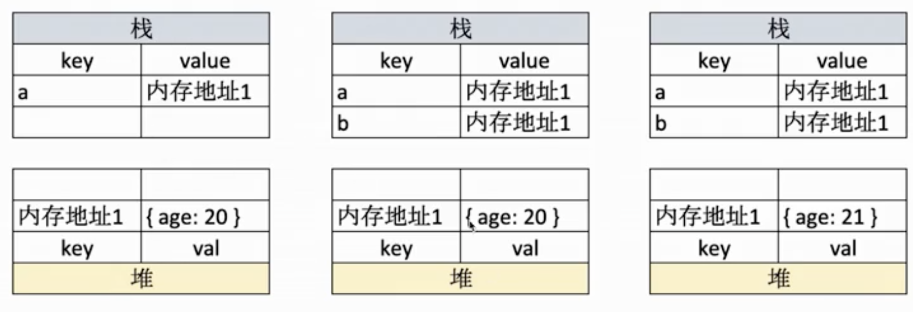

# 数据类型

## 值类型

- let a;//underfind (const 的定义的常量必须有初始值)
- const a = '' //string
- const a= 1 //number
- const a = true //boolean
- const a = Symbal('s')

## 引用类型

为什么设计引用类型？

    性能和存储的问题，值类型占用空间小，可以存在栈中。
    
    引用类型数据大，存在栈中不好管理。如果复制栈中的对象会很慢。

- 数组
- 对象
- null

```javascript
let a = 100
let b = a
a =200
console.log(b) // 100
```

值在栈中存储。


```javascript
let a = {age:20}
let b = a
a.age = 21
console.log(b) // {age:21}
```

引用类型，变量在栈中存储，对应的值存储的是引用地址，引用的值存储在堆中。
值在栈中存储。


深拷贝和浅拷贝都是针对的引用类型，JS 的变量类型分为值类型和引用类型；
值类型：存在栈中，对值类型拷贝会对值进行复制。
引用类型：会进行地址的拷贝，最终两个变量会指向同一个地址。

```javascript
// 引用类型指向同一份数据,会导致a b指向同一份数据，此时如果对其中一个进行修改，就会影响到另外一个
var a = {c: 1};
var b = a;
a.c = 2;
console.log(a.c, b.c); // 2, 2 全是2，a b指向同一份数据
```

### 深拷贝 VS 浅拷贝

深拷贝和浅拷贝都是针对引用类型来的，

- 浅拷贝只拷贝一层数据。
- 深拷贝递归遍历对象。

```javascript
var a1 = {b: {c: {}};

var a2 = shallowClone(a1); // 浅拷贝
a2.b.c === a1.b.c // true

var a3 = clone(a1); // 深拷贝
a3.b.c === a1.b.c // false
```

简版深拷贝实现（递归）

```javascript
function deepClone(json = {}) {
    if(typeof  json !== 'object'||json == null){
        return json;
    }
    let result;
    if(json instanceof Array){
        result = []
    }else{
        result = {}
    }
    for(let key in json){
        //保证key是json自身的属性
        if(json.hasOwnProperty(key)){
            result[key] = deepClone(json[key])
        }
    }

    return  result;
}

```

深拷贝（序列化反序列化实现）

- JSON.parse(JSON.stringify(test))
- Date 类型转换回来之后 Date 会变成字符串
- 转换的对象中有函数，undefined，则序列化的结果会把函数或 undefined 丢失；
- 有 NaN、Infinity 和-Infinity，则序列化的结果会变成 null

```javascript
var test = {
name: 'a',
date: new Date,
};
//{name: "a", date: Tue Aug 03 2021 11:33:33 GMT+0800 (中国标准时间)}
console.log(JSON.parse(JSON.stringify(test)))
//{name: "a", date: "2021-08-03T03:33:33.101Z"}
```
  
（原因：string 转 obj 时候，undefined、function、symbol 会在转换过程中被忽略。。。）

```javascript
const test = {
        a: null,
        b: function() {
          console.log('fff')
        },
        c: underfund
};
// {a: null, c: undefined, b: ƒ}

// {}
console.log(JSON.parse(JSON.stringify(test)))
```

### 浅拷贝实现

```javascript
function shallowClone(source) {
    var target = {};
    for(var i in source) {
        if (source.hasOwnProperty(i)) {
            target[i] = source[i];
        }
    }

    return target;
}
```

### 判断引式类型

```javascript
    Object.prototype.toString.call()
    Object.prototype.toString.call(undefined) //[object Undefind]
    Object.prototype.toString.call(new Error('111')) //[object Error]
    Object.prototype.toString.call(arguments) // [object Arguments]
    Object.prototype.toString.call(null) //[object Null]
    Object.prototype.toString.call([]) //[object Array]
    Object.prototype.toString.call({}) //[object Object]
    Object.prototype.toString.call(function(){}) //[object Function]
    Array.isArray
    obj instanceof Object
```
## typeof 运算符

可以判断的类型 可以识别所有值类型

```jvvascript

underfind

string

number

boolean

symbal

判断函数
typeof funcation a(){} // function

```

## instanceof 实现

寻找左边的对象的原型链中是否存在右边对象的原型对象。

```javascript
function instanceof(left,right) {
    let l = left.__proto__;
    let r = right.prototype;
    while (true){
        if(l === null){
            return false;
        }
        if(l === r){
            return  true;
        }
        l = r.__proto__;
    }

}
```


## 类型转换

强制类型转换比如：parseInt parseFloat toString

隐式类型转换：

- 1 if判断
- 2 逻辑运算
- 3 ==判断
- 4 字符串拼接等

```javascript

比如： 12 + '10' //输出结果 1210 (先把12转为string，在进行字符串拼接)

console.log(undefined==null) //true
console.log('0'==0) //true 字符串转数字
console.log(0==false) //true 布尔转数字
console.log('0'==false) //2个都转成数字
console.log(null==false) //false
console.log(undefined==false)//false
```

## 判断两个对象相等

```javascript

    function equal(a, b) { ... }

```
<font face="微软雅黑" color=#008000  size=5>判断两个NaN相等？</font>

 isNaN() 来判断一个值是否是数字。原因是 NaN 与所有值都不相等，包括它自己。

```javascript
// 主要利用NaN永远不等于自身
let a,b = NaN;
console.log(a == b);//false
function equal(a, b) {
    return a !== a && b !== b;
}
console.log(equal(NaN, NaN)); // true
```

<font face="微软雅黑" color=#008000  size=5>区分0和-0？</font>

JavaScript 采用了IEEE_754 浮点数表示法，1000(-0) 和 0000(0)都是表示 0 ，这才有了正负零的区别。

```javascript

-0.1.toFixed(0) === -0
Math.round(-0.1) === -0

(-0).toString() // '0'
(+0).toString() // '0'
0 === -0 // true

function equal (a,b){
    //返回的是正负无穷 Infinity 或者 -Infinity
    return a === b && 1/a === 1/b
}
```

