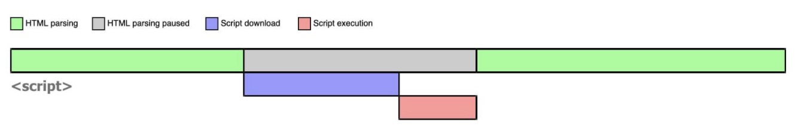
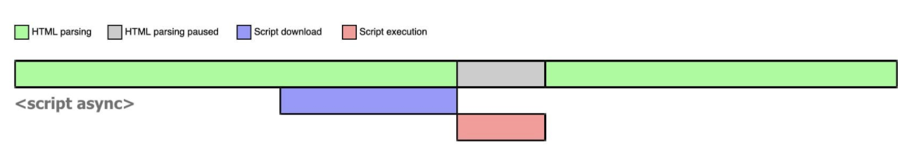
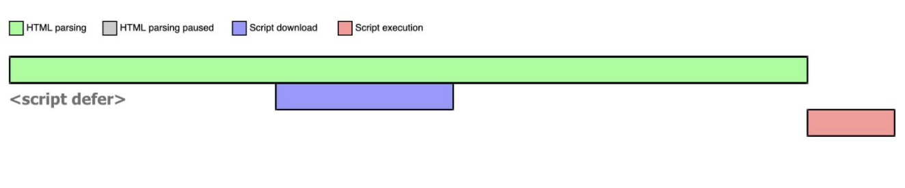

# 渲染过程

## 加载资源的形式
- html 代码
- 媒体文件 图片 视频
- js css 资源


## 线程与进程的区别

- 进程是 CPU 资源分配的最小单位；线程是 CPU 调度的最小单位。
- 一个进程由一个或多个线程组成，线程是一个进程中代码的不同执行路线；
- 一个进程的内存空间是共享的，每个线程都可用这些共享内存。

Chrome 浏览器中为例，当你打开一个 Tab 页时，其实就是创建了一个进程，一个进程中可以有多个线程（下文会详细介绍），比如渲染线程、JS 引擎线程、HTTP 请求线程等等。当你发起一个请求时，其实就是创建了一个线程，当请求结束后，该线程可能就会被销毁。

浏览器内核是多线程，在内核控制下各线程相互配合以保持同步，一个浏览器通常由以下常驻线程组成：

- GUI 渲染线程
```
主要负责页面的渲染，解析 HTML、CSS，构建 DOM 树，布局和绘制等。
当界面需要重绘或者由于某种操作引发回流时，将执行该线程。
该线程与 JS 引擎线程互斥，当执行 JS 引擎线程时，GUI 渲染会被挂起，当任务队列空闲时，JS 引擎才会去执行 GUI 渲染。

```
- JavaScript 引擎线程

```
该线程当然是主要负责处理 JavaScript 脚本，执行代码。
也是主要负责执行准备好待执行的事件，即定时器计数结束，或者异步请求成功并正确返回时，将依次进入任务队列，等待 JS 引擎线程的执行。
当然，该线程与 GUI 渲染线程互斥，当 JS 引擎线程执行 JavaScript 脚本时间过长，将导致页面渲染的阻塞。
```
- 定时触发器线程
```
负责执行异步定时器一类的函数的线程，如： setTimeout，setInterval。
主线程依次执行代码时，遇到定时器，会将定时器交给该线程处理，当计数完毕后，事件触发线程会将计数完毕后的事件加入到任务队列的尾部，等待 JS 引擎线程执行。
```
- 事件触发线程
```
主要负责将准备好的事件交给 JS 引擎线程执行。
比如 setTimeout 定时器计数结束， ajax 等异步请求成功并触发回调函数，或者用户触发点击事件时，该线程会将整装待发的事件依次加入到任务队列的队尾，等待 JS 引擎线程的执行。
```
- 异步 http 请求线程


## 输入 URL 到页面加载完成，发生了什么？

主要分为以下5个部分 

- DNS（域名解析系统)查找域名对应的ip
- TCP连接，和DNS解析拿到的ip建立TCP连接
- HTTP请求，基于TCP发起HTTP请求
- 服务端接到请求处理，返回响应内容
- 解析获取返回的响应内容

#### HTTP优化方向
 
 减少请求次数 减少单次请求耗时 （即资源的压缩与合并）


## 加载资源的过程

- DNS 解析 域名——>IP 地址，
  还可以根据不同地域访问不同地域的云服务器，这样可以加快访问速度。
- 浏览器根据 Ip 地址向服务器发起 http 请求（三次握手）
- 服务器处理 http 请求，返回给浏览器。
- 根据 HTML 代码生产 DOM Tree。
- 根据 CSS 生产 CSSOM。（CSSOM css 对象模型）
- 将 DOM Tree 和 CSSOM 整合形成 Render Tree。
- 浏览器根据 Render Tree 渲染页面。
- 遇到 script 则暂停渲染，优先加载执行 js 代码。执行完在继续。

## css 为什么要尽量放在 head 中

因为浏览器解析时，从上到下解析，生成 DOM-tree， 生成 CSSOM，生成 Render tree。如果把 css 放在 body 中，此时生成的 Render Tree 可能不包含这段 css 代码片段，浏览器需要对比生成的 Render tree。造成二次渲染。

```html
<html>
    <head>
        <meta charset="utf-8">
        <title>title</title>
        <link src="index.css">
    </head>
    <body>
    #div{
        color:red;
        fontSize:20px;
    }
    <div>111</div>
    </body>
</html>
```

## 为什么建议把 js 放在 body 最后？

js 在页面中，渲染的过程中会占用主线程，堵塞页面渲染，
所以要把 js 外在 body 外边。先让页面解析显示出来，然后执行 body 外的 js 对解析出来的 render tree 做修改。

## window.onload VS DOMContentLoaded

- onload 页面全部加载完才执行 包活 视频 图片资源
- DOM 渲染完既可执行，此时图片 视频还可以没有加载
  主线程是 JS 发生的地方.也是渲染发生的地方，是 DOM 存在的地方。

网页上大部分活动都是有确定性的顺序，我们不会同时去运行多段代码去修改同一处 DOM。

如果 一个任务运行 200ms，用户就会感觉到，因为它阻止了加载 渲染 和交互

计算机中有主线程，但我们还需其他线程 比如网络请求 编码解码 加密监控输入设备。一旦这些线程有需要页面响应的相关操作，我们都需要通知主线程。

我们通过事件循环来协调这些活动，

```
//在主线程上运行，当我们需要等待5000ms，我们是在主线程上等待，阻止了主线程上的其他活动，
setTimeOut在主线程上运行，同时回调函数也会在主线程上执行。
setTimeOut(callback,ms)


如果把setTiemOut移出主线程 会有大量并行运行的JS，编辑相同的DOM。
```

解决方法
创建一个任务加到任务队列，以便在某个时刻回到主线程继续执行，我们在 js 所有线程上调用 js，这种方案都行的通。

当用户点击鼠标，操作系统如何通知 js？
通过向任务队列中添加任务，网络请求的数据也是向队列中添加任务，

所以主线程是在任务队列中读取任务的。

## setTimeOut 不适合做动画

因为一帧中，setTimeOut 都会执行多次，假设每一帧 setTimeOut 被执行四次，那么其中 3 次的任务都是无效，因为浏览器并不会渲染。
而且可能存在当前这一帧没有任务执行，下一帧有几个 setTimeOut 执行，这样就造成了

requestAnimationFrame 回调函数运行在处理 css 之前和绘制之前，

执行任务的阶段，浏览器不考虑 css 的变化，当它真正执行到渲染时，浏览器会看你到底改变了什么。

## 异步加载资源
### script无 async 或 defer时

```javascript
<script src='app.js'></script>
<script src='app.js' async></script>
<script src='app.js' defer></script>
```

浏览器在解析 HTML 的时候，如果遇到一个没有任何属性的 script 标签，就会暂停解析，先发送网络请求获取该 JS 脚本的代码内容，然后让 JS 引擎执行该代码，当代码执行完毕后恢复解析。整个过程如下图所示：

可以看到，script 阻塞了浏览器对 HTML 的解析，如果获取 JS 脚本的网络请求迟迟得不到响应，或者 JS 脚本执行时间过长，都会导致白屏，用户看不到页面内容。
 
### async script

当浏览器遇到带有 async 属性的 script 时，请求该脚本的网络请求是异步的，不会阻塞浏览器解析 HTML，一旦网络请求回来之后，如果此时 HTML 还没有解析完，浏览器会暂停解析，先让 JS 引擎执行代码，执行完毕后再进行解析.

如果async脚本已经回来，会暂停浏览器解析Html，等async脚本执行完后继续浏览器解析Html.

 
### defer script
 defer 属性的 script 时，获取该脚本的网络请求也是异步的，不会阻塞浏览器解析 HTML，一旦网络请求回来之后，如果此时 HTML 还没有解析完，浏览器不会暂停解析并执行 JS 代码，而是等待 HTML 解析完毕再执行 JS 代码.




|  表头   | JS 执行顺序	  | 效果 |
|  ----  | ----  | ----|
|  script| 在 HTML 中的顺序 | 阻塞解析html|
|  async| 网络请求返回顺序	 | 不阻塞解析html 但执行脚本依赖于脚本返回的时间|
|  defer| 网络请求返在 HTML 中的顺序 | 不阻塞解析html 在解析html之后 才执行脚本|