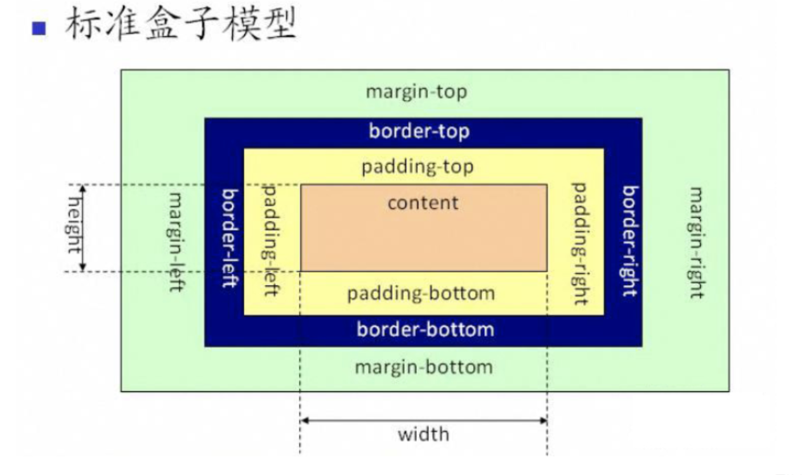

# 盒子模型

盒模型通过四个边界来呈现元素的大小：margin（外边距）、border（边框）、padding（内边距）、content（内容区域）。

盒子总宽度 = width + padding + border + margin
offsetWidth = (内容宽度+内边距+边框)，无外边距
标准盒子模型和 IE 盒子模型的区别是 content 的计算，标准盒子模型中 content 不包含其他部分，IE 盒子模型 content 包含 padding 和 border，目的是为了避免撑起 content。

## 标准盒子模型

- box-sizing:content-box（默认）

## IE 盒子模型

- box-sizing:border-box

IE 盒子模型和标准盒子模型的区别
IE 盒子模型的 content 部分包含了 padding 和 border

一个盒子用 IE 盒子模型和标准盒子模型的宽高。
width 100px;
border：2px;
padding:10px;
margin:20px;

在 标准 盒子模型中: 宽度：100 + (2*2)+ (10*2) +(20\*2)=164
在 IE 盒子模型中： 宽度: 100 + (20\*2) = 140
