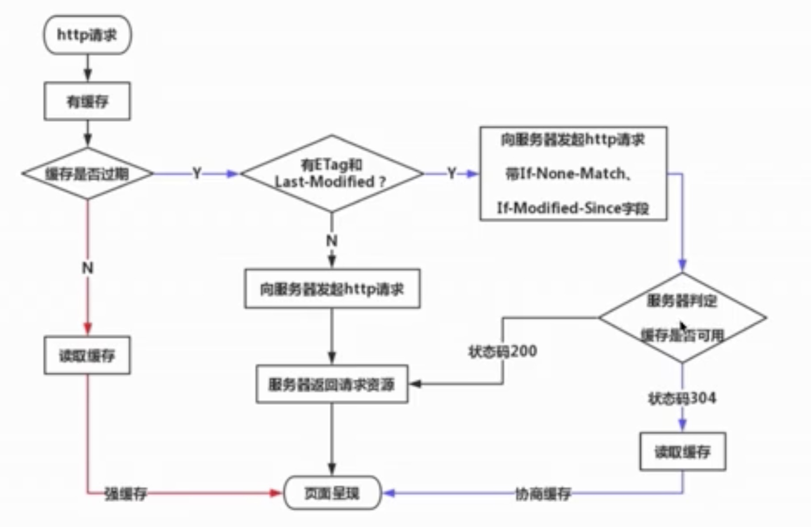

# 缓存

哪些资源可以被缓存？
静态资源（js css img） （webpack打包配置的hash值是根据 资源来算的。如果资源内容有更改，webpack打包的hash值会发生变化。）


## 强缓存

强缓存，初次请求，后端 返回资源 和Cache-Control （Cache-Control: max-age=60）。

再次请求，浏览器判断是否Cache-Control，如果命中走缓存。（强缓存状态码200）。 如果缓存失效，走协商缓存或者向服务端请求资源。
       
- public 可向任意方提供响应的缓存
- private 仅向特定用户返回响应
- no-cache 不用强制缓存,走协商缓存
- no-store 不进行任何缓存
## 在nginx上配置开启强缓存
```js
location / {
    
    location ~* \.(?:jpg|jpeg|png|gif|ico|css|js)$ {
            # expires 60s;
            //开启cache-control max-age缓存时间，在时间范围内在缓存中读资源
            add_header Cache-Control max-age=60;
        }
    root   html;
    index  index.html index.htm;
}
```

## 协商缓存

服务端缓存策略，服务端判断是否需要缓存。服务端判断客户端资源，是否和服务端资源一样。一致返回304，否则返回200和最新资源。

后端的静态资源不断更新，浏览器默认使用强缓存，会默认从浏览器缓存中取到过时的资源。我们希望浏览器每次获取资源的时候都向后端确认资源是否更新，就要设置浏览器使用协商缓存。后端如何判断资源是否更新了呢？这时就要用到Etag和Last-Modified两项响应头。

- last-Modifed资源最后的修改时间。
- Etag资源的唯一标识。
```js
// 初次请求,返回状态码200，服务端在响应头返回 ETag 和 Last-Modified
    状态代码: 200 OK

    响应头：
    ETag: "616d4f66-cee8" 
    Last-Modified: Mon, 18 Oct 2021 10:41:42 GMT

// 二次请求，服务端收到当前请求头的If-Modified-Since和If-None-Match会
//         和资源生成的etag和last-modified对比。若两者一致资源未改动（Not Modified
//         资源会被重定向到浏览器缓存，这种情况下网络请求对应的状态码是 304
    状态代码: 304 OK

    请求头：
    //首次请求后的每次请求，会带上一个叫 If-Modified-Since 的时间戳字段，它的值正是上一次 response 返回给它的 last-modified 
    If-Modified-Since: Mon, 18 Oct 2021 10:41:42 GMT
    If-None-Match: "616d4f66-cee8"
    
    响应头：
    ETag: "616d4f66-cee8"
    Last-Modified: Mon, 18 Oct 2021 10:41:42 GMT


```
## Etag vs last-Modifed

last-Modifed弊端： 
- 1我们编辑了文件，但文件的内容没有改变。服务端并不清楚我们是否真正改变了文件，它仍然通过最后编辑时间进行判断。所以这种情况不能命中缓存。
- 2修改文件过快，比如300ms修改了一个文件，If-Modified-Since 只能检查到以秒为最小计量单位的时间差，所以此时浏览器会错误命中缓存。

Etag

优势：精准地感知文件的变化 ，Etag 是由服务器为每个资源生成的唯一的标识字符串，这个标识字符串是基于文件内容编码的，只要文件内容不同，它们对应的 Etag 就是不同的。
弊端：生成过程需要服务器额外付出开销，会影响服务端的性能。

优先级：Etag 在感知文件变化上比 Last-Modified 更加准确，优先级也更高。当 Etag 和 Last-Modified 同时存在时，以 Etag 为准。

```js
// 首次请求 服务端返回Etag
状态码：200
响应头：
Tag: "616d4f66-cee8"
// 再次请求，在请求头携带 If-None-Match
状态码：304
请求头：
If-Modified-Since: Mon, 18 Oct 2021 10:41:42 GMT
If-None-Match: "616d4f66-cee8"
响应头：
ETag: "616d4f66-cee8"
Last-Modified: Mon, 18 Oct 2021 10:41:42 GMT

```

## CDN
CDN作用： 存放静态资源JS、CSS、图片等不需要业务服务器进行计算即得的资源。静态资源本身具有访问频率高、承接流量大的特点。必须要走CDN。

- 缓存: 把资源 copy 一份到 CDN 服务器上这个过程

- 回源: CDN 发现自己没有这个资源（一般是缓存的数据过期了），转头向根服务器（或者它的上层服务器）去要这个资源的过程

CDN使用的优化

（Cookie 是紧跟域名的）CDN和主页使用不同的域名，主页请求一般需要携带cookie信息，将CDN静态资源和主页面置于不同的域名下，完美地避免了不必要的 Cookie 的出现。