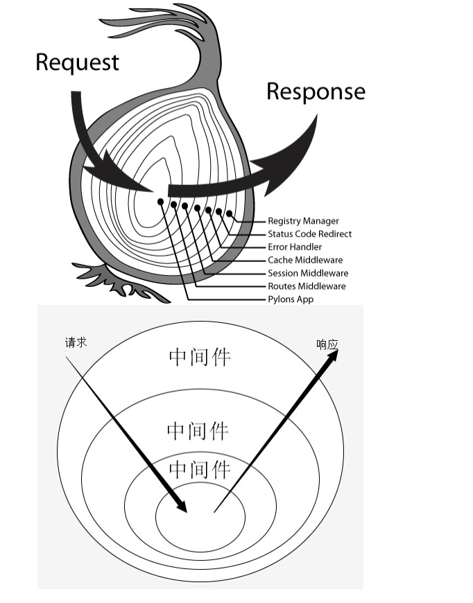

# Koa框架

特点：
- 1 利用async await解决了同步写异步问题。
- 2 独特的中间件控制流程（洋葱模型），面向切面编程。


## 洋葱模型

koa通过使用洋葱模型，我们可以达到面向切面的作用。


```javascript
const fs = require('fs');
const Koa = require('koa');
const app = new Koa();

app.use(async (ctx,next)=>{
    console.log('第一层洋葱开始')
    const startTime = new Date();
    console.log(startTime)
    await next()    
    const endTime = new Date();
    console.log(endTime)
    console.log('offset',endTime - startTime)
    console.log('第一层洋葱结束')
})

app.use(async (ctx,next) =>{
    console.log('第二层洋葱开始')
    ctx.body =[{name:'hello'}];
    await next();
    console.log('第二层洋葱结束')
})


process.on('uncaughtException',function(res){
    console.log('res',res)
})
app.listen(3000)

//========打印顺序========

console.log('第一层洋葱开始')
console.log('第二层洋葱开始')
console.log('第二层洋葱结束')
console.log('第一层洋葱结束')

```