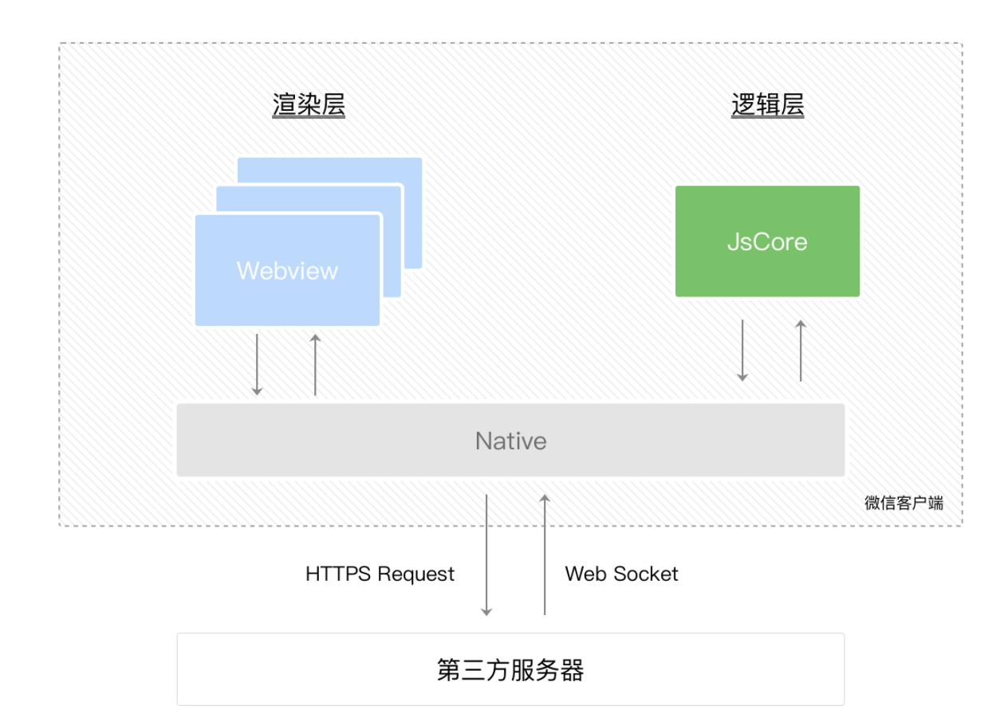
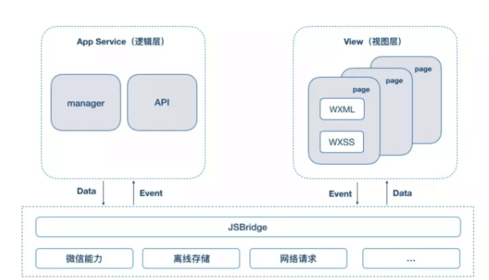
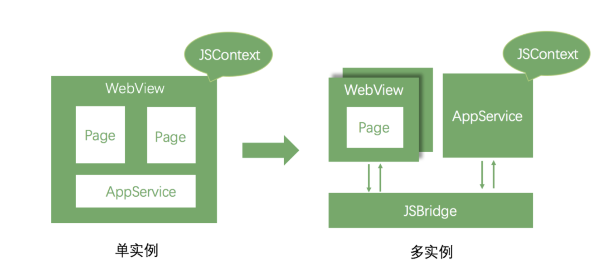
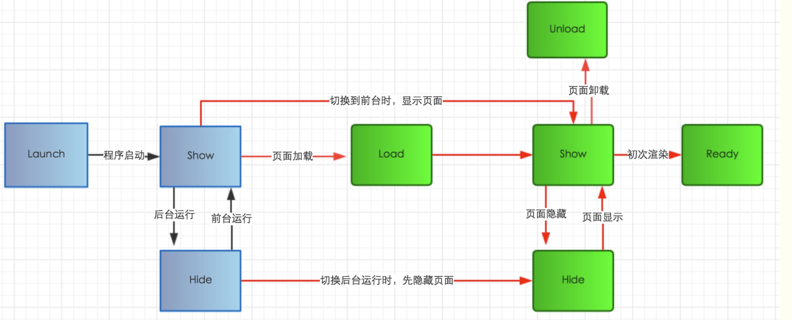

## 小程序架构设计

### 双线程
    
小程序的渲染层和逻辑层分别由两个线程管理：渲染层的界面使用 WebView 进行渲染；逻辑层采用 JSCore 运行 JavaScript 代码。一个小程序存在多个界面，所以渲染层存在多个 WebView。这两个线程间的通信经由小程序 Native 侧中转，逻辑层发送网络请求也经由 Native 侧转发，小程序的通信模型下图所示。


- 视图层主要负责页面的渲染
- 逻辑层负责js的执行。
- 视图层和逻辑层之间通过event和data来通信（通过微信客户端作为宿主载体）。通过jsBridge来调用原声的API。比扫码 相机等。
- 我们打包出来的代码就是html css。使用webView作为载体渲染。多个页面就是多个webview。
- 逻辑层由独立jsCore作为js运行的环境。和浏览器不一样的是，只有一些js对象的方法，不能直接操作DOM。需要在渲染层和逻辑层之间通过native通信才能传递数据。
- WebView 和 JavascriptCore 都是独立的模块，并不具备数据直接共享的通道。



## 渲染线程和逻辑线程间的通信

WebView 和 JavascriptCore 都是独立的模块，并不具备数据直接共享的通道。即（沙箱机制）

视图层和逻辑层的数据传输，实际上通过两边提供的 evaluateJavascript 所实现。 即用户传输的数据，需要将其转换为字符串形式传递，同时把转换后的数据内容拼接成一份 JS 脚本，再通过执行 JS 脚本的形式传递到两边独立环境。

- 是基于消息驱动来渲染的，所以不会阻塞页面。我的渲染不会影响你的js逻辑，js的执行也不会柱塞渲染的过程；
- 渲染线程 和 逻辑线程之间交互都要通过native中转。
- 在逻辑线程中禁止开发者直接 跳转页面 操作DOM 逻辑层和渲染层分离。                   



### 三端的脚本执行环境对比

|  运行环境   | 逻辑层  | 渲染层
|  ----  | ----  | ----  |
| 安卓  | V8 | Chromium定制内核 |
| 苹果  | JavaScriptCore | WKWebView |
| 小程序  | NWJS | ChromeWebView |


### 单实例VS多实例

- 单WebView 模式下，Page 视图与 App 逻辑共享同一个 JSContext 这样所有的页面可以共享全局的数据和方法 能够实现全局的状态管理。

- 多webView模式(小程序)每一个 WebView 都有一个独立的 JSContext，虽然可以通过窗口通信实现数据传递，但是无法共享数据和方法，对于全局的状态管理          也相对比较复杂，抽离一个通用的 WebView 或者 JS Engine 作为应用的 JSContext 就可以解决这些问题，但是同时引入了其他问题：视图和逻辑如何通信，在小程序里面数据更新后视图是异步更新的。




### 小程序双线程模型 和 生命周期

界面渲染的整体流程

- 1、在渲染层将wxml文件与wxss文件转化成js对象也就是虚拟DOM
- 2、在逻辑层将虚拟的DOM对象配合生成真实的DOM树，再交给渲染层渲染
- 3、当数据变化时，逻辑层提供更新数据，js对象发生改变，用diff算法进行比较
4、将更新的内容反馈到真实的DOM树中，更新页面


- 小程序为了安全和性能的考虑，使用了双线程模式架构。用户js是一个纯粹的jCore。
- 把web代码转化为小程序代码。uni，taro是将template模版和jsx转换为小程序WXML模版。
- 小程序的渲染层和逻辑层分别由两个线程管理：渲染层的界面使用 WebView 进行渲染；


生命周期




```angular2html
 /**
   * 当小程序初始化完成时会触发onlaunch(全局只触发一次)
   */
  onLaunch: function () {
          console.log("小程序的初始话：onlaunch")
  },
 /**
   * 页面载入后触发onShow方法，显示页面。
   * 当小程序启动或是从后台进入到前台的时候，会执行onshow,那我们可以通过这个option中的scene值来判断不同进入场景
   */
  onShow:function(option){
    console.log("小程序onshow，：onShow",option)
  }

 /*小程序从前台进入到后台时触发：onHide*/
  onHide:function(){
    console.log("小程序从前台进入到后台的时候，会触发：onHide")
  },

 /*页面加载时执行onload方法：onLoad*/
 onLoad:function(){
  console.log("小程序页面加载，会触发：onLoad")
 },

/*页面销毁执行onUnload方法：onUnload*/
 onUnload:function(){
  console.log("小程序销毁，会触发：onUnload")
 },


```


