# 项目总结

### 首汽GoFun智能中枢 数据大屏
 项目反思： 
 - 1 通过该项目，只要使用到了transform缩放的一些特性，并在onResize过程中使用节流防抖的区别和实现原理做了总结。
 - 2 通过使用flexable了解到了npm发布个人包过程。以及在响应式布局实现上总结了REM布局实现原理。
 - 3 项目中引入了ts，这是之前项目中没有用到了，并对ts的基本使用有了一些了解。
 - 4 项目中有大量使用了emitBus的场景，并对emitBus的实现做了总结。
 - 5 项目中有有车辆分布图，车辆轨迹等。使用高德地图API，对绘制海量点 轨迹图以及大量数据点高德地图优化有了一些了解。
 - 6 项目中有很多echarts图表，也对这方面加深了数量度。
    
     该项目前期设计时候，我都是把左右两侧模块分割成小组件，这样在后面两个版本迭代里能更高效。
总的来说，这是我来该公司做的第一个项目，学到的东西还是挺多的。唯一遗憾的是，只让我做了第一期的功能，后面把我分到了其他业务上。所以有些遗憾，该项目还存在非常大的优化空间没来得及做。

项目效果图
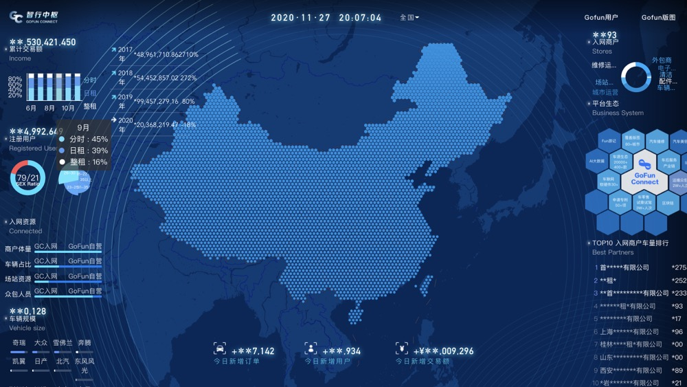
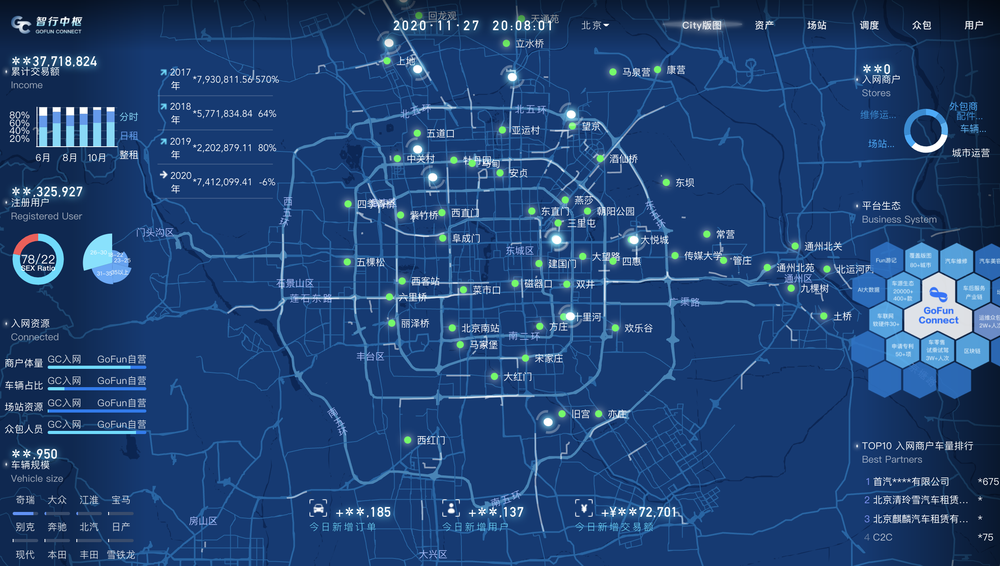
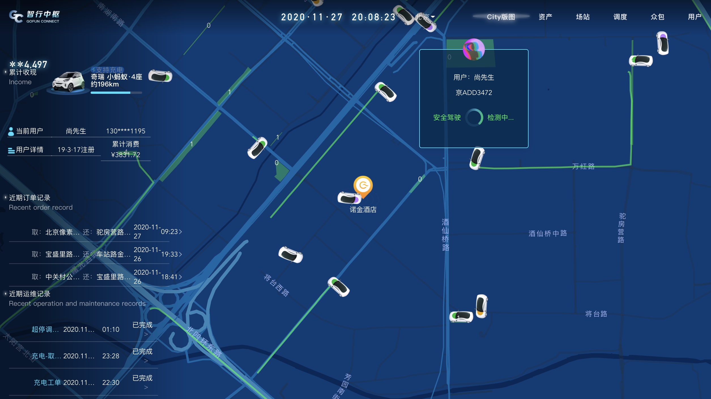

### GoFun客户端内嵌H5

在职过程中主要做了，砍一刀活动（类似拼多多砍价）， 试乘试驾 ，十月一购车节，极星调查问券。以及配套的CRM系统模块的开发。

 项目反思：
 
 - 1 h5活动页跟业务关联不大，开发上手容易，技术栈主要用的大多都是vue，主要学习了一些很原生bridge的交互。
 - 2 h5移动端页面过程中也学习到了一些移动端兼容性的问题，并做了总结。比如滑动卡顿，1px不精准等 穿透等。
 - 3 在CRM上技术栈主要是React+AntDesign 之前React写的少一些，也熟悉了一下React的一些API。
 - 4 使用神策API对活动点击量，访问量等做数据埋点。
 
砍一刀活动
 
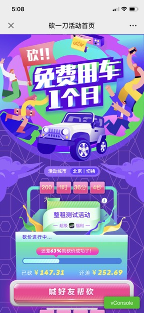

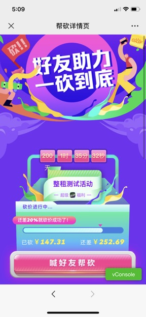

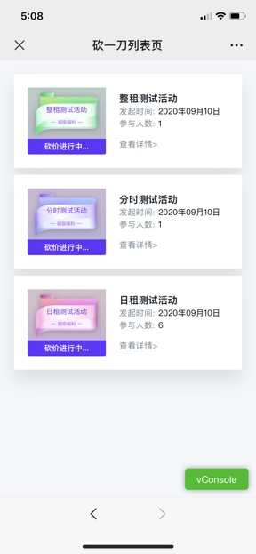

极星调查问券

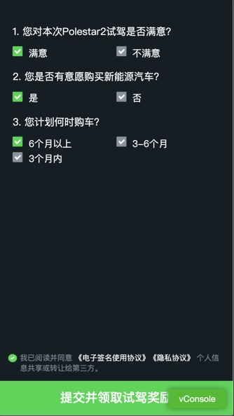

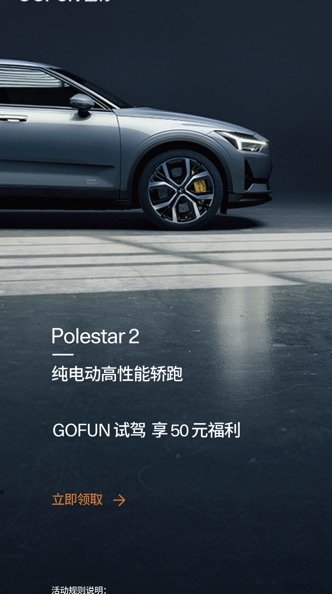

试乘试驾

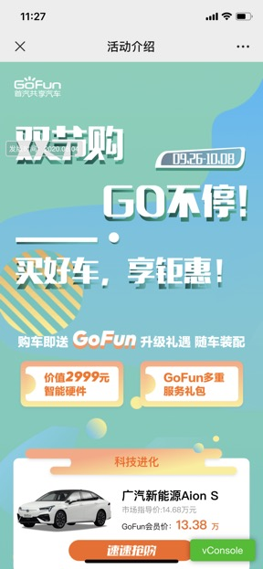

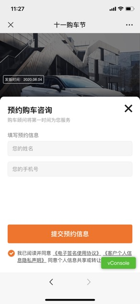

## 云乐汇融科 （ 2019年1月 ~ 2020年8月 ）
### 聚合平台项目+中台+小程序

-（BtoBtoC型电商平台）

  云乐汇通过共享新零售赋能搭建全域生态聚合产业平台，“技术、金融、云供应链、运营”四大赋能体系的精准赋能，实现产品共享、流量共享和渠道共享，激发线下实体商户和线上平台型企业自主快速成长，在平台生态中，通过专属且唯一的会员身份识别系统，实现互为分销、收益共享、效益倍增的成长生态环境，通过把线下场景和故事搬到线上的独特方式，营造交互沉浸式体验的线上线下相融合的生态平台。

- 成果物：B端小程序+云乐汇壹厂+C端小程序+聚合管理系统+中台系统
- 项目职位:前端负责人

C端云乐汇壹厂

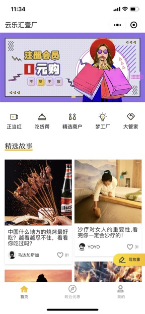

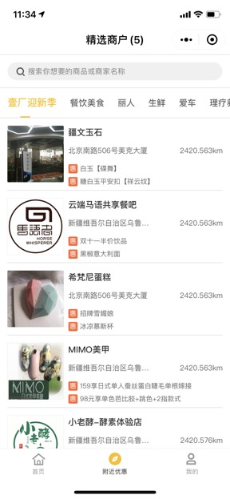

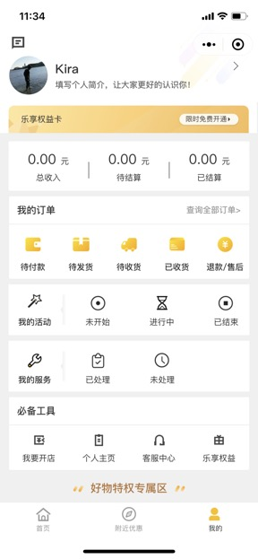

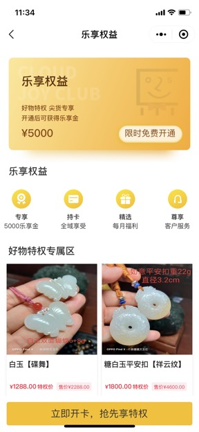

B端

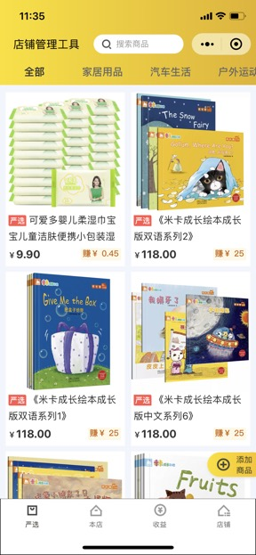

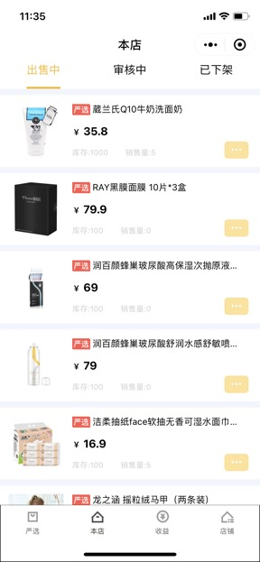

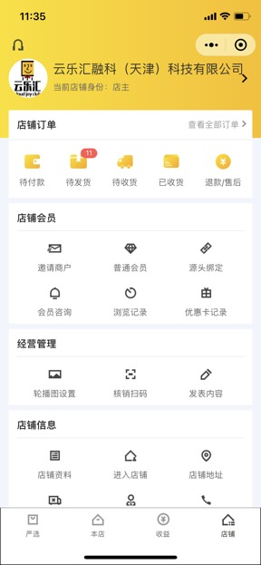

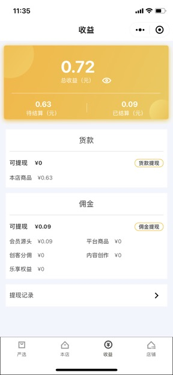
