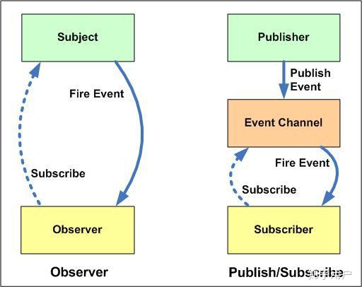

# 响应式系统

## 发布订阅模式 VS 观察者模式

个人理解：

- 观察者模式是是观察对象和目标直接进行交互。（数据源直接通知订阅者发生改变。）
- 发布订阅模式是在观察者模式上做的优化，目标和订阅者中间存在一个调度的中间层，由中间层统一控制。（数据源告诉第三方（事件频道）发生了改变，第三方再通知订阅者发生了改变。）
  
  

## Object.defineProperty

- 深度监听需要一次性递归
- 无法监听对象/删除属性的方法（Vue.$set,Vue.$delete）
- 无法监听数组方法，需特殊处理
- Object.defineProperty因为性能的考虑并不会对 如[1,2,3]的每个值都进行监听
```
Object.defineProperty()虽然对对象中的每个属性进行了劫持，但对于对象的添加/删除方法是不能检测到的。
（如 delete this.info.name,删除后视图不会进行更新，需要用到Vue.$set,Vue.$delete）。

Object.defineProperty()不会对数组中的每个元素进行劫持（性能考虑的原因）,所以在
(this.list[0] == '111')并不会触发视图的更新。
```

## Proxy使用

- 相比defineProperty性能更好，具有惰性，只会把目前使用到的这层变为响应式。
- 可监听新增/删除的属性
- 可监听数组的变化


```javascript
proxy作为一个代理，Reflect作为一个反射。
const json = {name:"111"};
const proxy = new Proxy(json,{
    get(target,key,receiver){
        const result = Reflect.get(target,key,receiver)
        const ownKeys = Reflect.ownKeys(target);
        console.log(ownKeys)
        if(ownKeys.includes(key)){
            console.log('get',key)
        }
        return result;
    },
    set(target,key,val,receiver){
        const oldVal = target[val];
        if(oldVal === val){
            return true;
        }
        console.log('set',key,val);
        //Reflect.set返回true/false
        const result = Reflect.set(target,key,val,receiver)
        return result;
    },
    deleteProperty(target,key,receiver){
         console.log('delete',key);
        const result = Reflect.deleteProperty(target,key,receiver)
        return result;
    }
})
```

## Reflect

```javascript
const obj = {a:1,b:2};

'a' in obj === Reflect.has(obj,'a')

delete obj.a === Reflect.deleteProperty(obj,'a')

Object.getOwnPropertyNames(obj) === Reflect.ownsKeys(obj)


```
## 对象侦测

```javascript
    function observer(target){
        if(typef target !== 'object' || target === null){
            return;
        }
        for(key in target){
            defineReactive(target,key,target[key])
            console.log(key)
        }
    }
    function defineReactive (target,key,val){
        //递归调用
        observer(target[key])
        Object.defineProperty(target,key,{
            get() {
                console.log('get');
                return value;
            },
            set:function (newValue) {
                console.log('set');
                if(newValue !== value){
                    target[key] = newValue;
                }
            }
        })
    }
    let json = {
        name:'kira',
        age:30,
        address:{
            text1:{
                des1:1,
                des2:3
            },
            text2:2
        }
    }
    console.log('json.name',json.name)
    observer(json)
```

## 数组侦测

思路：由于 Object.defindProperty()不具备侦测数组的能力，vue 通过对原生数据方法进行替换，当劫持到 key 是数组类型，通过自定义的数组操作方法覆盖该 key 原型上数组的操作方法。

自定义数组操作方法的实现思路，更新视图，并原生数组操作方法。

```javascript
//重新定义数组原型
const oldArrayProperty = Array.prototype;
//创建新对象 原型指向oldArrayProperty 扩展的新方法不会影响原型
const arrProto = Object.create(oldArrayProperty);
// pop push shift unshift splice
['pop','push','shift','unshift','splice'].forEach(name=>{
    arrProto[name] = function () {
        //更新视图
        updateView();
        //调用原生数组更新方法
        oldArrayProperty[name].call(this,...arguments)
    }
});

function observer(target){
    if(typeof target !== 'object' || target === null){
        return;
    }

    if(Array.isArray(target)){
        target .__proto__ =  arrProto
    }
    for(key in target){
        defineReactive(target,key,target[key])
        console.log(key)
    }
}

function updateView() {
    console.log('更新视图')
}
function defineReactive (target,key,val){
    //递归调用
    observer(target[key]);
    Object.defineProperty(target,key,{
        get() {
            console.log('get');
            return val;
        },
        set:function (newValue) {
            console.log('set');
            if(newValue !== val){
                target[key] = newValue;
            }
        }
    })
}
let json = {
    name:'kira',
    age:30,
    address:{
        text1:{
            des1:1,
            des2:3
        },
        text2:2
    }
};
console.log('json.name',json.name);
observer(json);

```
