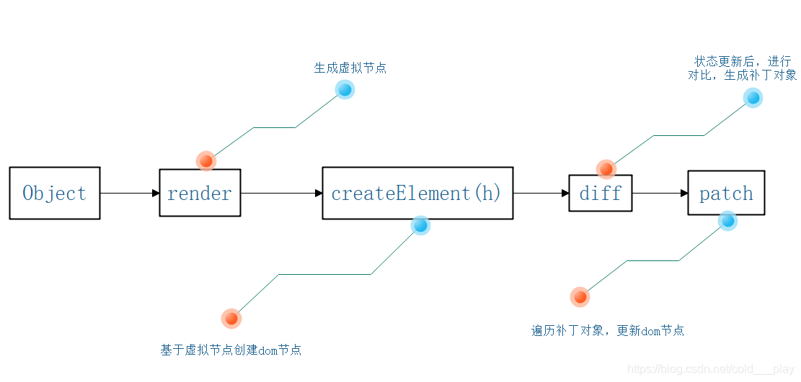

# 虚拟 DOM

## Virtual Dom 运行过程：



- 正常的 DOM 节点在 HTML 中是这样的：

```
<div id="main">
    <p>文本内容</p>
    <p>文本内容</p>
</div>
```

- 用 Virtual Dom 创建的 JavaScript 对象一般会是这样的：

```
var vNode = {
    tag: 'div',
    attributes:{
        id: 'main'
    },
    children: {
        //p节点
    }
}
```

- Virtual Dom 就是通过一种 VNode 类表达的，每个 DOM 元素或组件都对应一个 VNode 对象。

  每个 VNode 有 children，children 每个元素也是一个 VNode，这样就形成了一个 VNode Tree，它很好的描述了我们的 DOM Tree。

```
export interface VNode{
    tag?: string;
    data?: VNodeData;
    children?: VNode[];
    text?: string;
    elm?: Node;
    ns?: string;
    context?: Vue;
    key?: string | number;
    componentOptions?: VNodeComponentOptions;
    componentInstance?: Vue;
    parent?: VNode;
    raw?: boolean;
    isStatic?: boolean;
    isRootInsert: boolean;
    isComment: boolean;
}
```

树 diff 的时间复杂度 o(n 的三次 3)
过程 1 遍历 tree1，第二遍历 tree2 第三排序，这三个循环一组合就是 o(n 的三次 3)

优化时间复杂度到(O(n))

- 只同级比较，不跨级比较
- tag 不相同，直接删掉重建，不再深度比较
- tag 和 key，两者都相同，则认为是相同节点，不再深度比较

## Diff 算法 比较策略 深度优先，同层比较

snabbdom

- 相同的 vnode，（key 和 tag 都相同）patch 对比，不同的 vnode 销毁重建

## 如何理解 vue 中的 Diff 算法？

- diff 算法是虚拟 DOM 技术的必然产物，通过新旧虚拟 DOm 的对比（既 Diff）将变化的地方更新在真实 DOM 上，另外也需要 Diff 高效的执行对比过程，从而降低时间复杂度 O(n).
- vue2.x 为了降低 watcher 的颗粒度，每个组件只有一个 watcher，引入 Diff 可以精准找到 DOM 变化的地方。
- vue 中 diff 执行时候组件实例执行更新函数时。它会对比上一次渲染结果 oldNode 和新的渲染结果 newNode。此过程称为 patch。
- diff 过程深度优先，同层比较。两个节点之间会根据他们是否拥有子节点或者文本节点做不同操作。比较两组子节点是算法的重点。假设头尾节点可能相同做 4 次比对尝试。如果 没有找到相同节点才按照通用方式遍历查找。查找结束在按情况处理剩下节点，借助 key 通常可以精准的找到相同节点，因此整个 patch 过程很高效。
