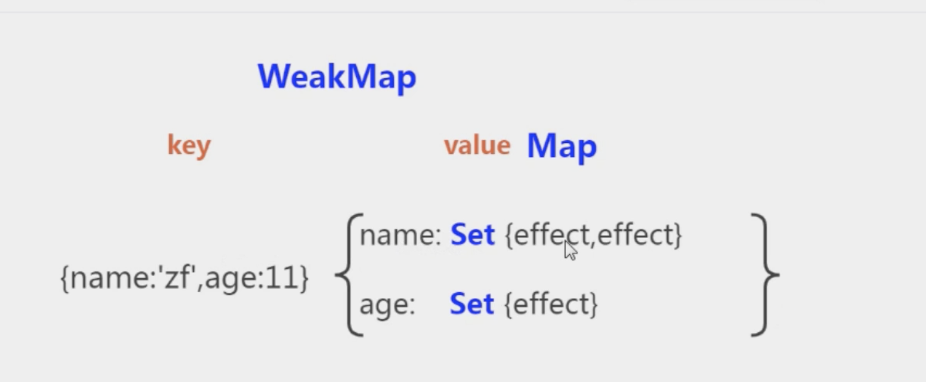

# 响应式Reactive

### Proxy的优势

- proxy可以直接监听数组的变化；
- proxy可以监听对象而非属性.它在目标对象之前架设一层“拦截”，外界对该对象的访问，都必须先通过这层拦截，因此提供了一种机制，可以对外界的访问进行过滤和改写。 Proxy直接可以劫持整个对象,并返回一个新对象。

```javascript
//一个普通的对象通过proxy劫持，返回的是一个响应式的对象
const proxyData = new Proxy(data,{
    get(target,key,receiver){
        const result = Reflect.get(target,key,receiver)
        return result
    },
    set(target,key,val,receiver){
        const result = Reflect.set(target,key,val,receiver)
    },
    deleteProperty(target,key){
        const result = Reflect.deleteProperty(target,key)
        return result;
    }
})
```

## Reflect是什么？
Reflect是ES6为了操作对象而新增的API, 为什么要添加Reflect对象呢？它这样设计的目的是为了什么？
- 将Object对象的一些明显属于语言内部的方法(比如Object.defineProperty)，放到Reflect对象上，那么以后我们就可以从Reflect对象上可以拿到语言内部的方法。
- 在使用对象的 Object.defineProperty(obj, name, {})时，如果出现异常的话，会抛出一个错误，需要使用try catch去捕获，但是使用 Reflect.defineProperty(obj, name, desc) 则会返回false。

```javascript
const obj = {a:1,b:2};

'a' in obj === Reflect.has(obj,'a')

delete obj.a === Reflect.deleteProperty(obj,'a')

Object.getOwnPropertyNames(obj) === Reflect.ownKeys(obj)
```

## WeakMap结构
  

## Reactive的实现原理

```javascript
//调用
const state = reactive({count:1})
effect(()=>{    
    console.log('触发effect',state.count)
})
state.count = 11111111;
```
```javascript
//reactive实现过程
function reactive(target){
        return createReactiveObject(target,{
            get(target,key,receiver){
                const  res = Reflect.get(target,key,receiver);
                //依赖收集
                //console.log('get执行了')
                track(target,'get',key);
                //如果 取到的值是数组或者对象再次进行proxy劫持
                if(isObject(res)){
                    return reactive(res);
                }
                return res; 
            },
            set(target,key,value,receiver){
                console.log('set执行了')
                const oldVal = target[key];
                const hasKeys = hasOwn(target,key);
                const isSuccess = Reflect.set(target,key,value,receiver)
                //新增的属性
                if(!hasKeys){
                    //派发更新
                    trigger(target,'add',key,value)
                //修改操作
                }else if(oldVal !== value){            
                    trigger(target,'set',key,value)
                }
                //值没有变化什么都不做
                return isSuccess;
            }
        })
}
function isObject(val){
    return typeof val === 'object' && val !=null;
}

function hasOwn(target,key){
    
    return Object.prototype.hasOwnProperty.call(target,key);
    // return Reflect.hasKeys(target,key);
}
function createReactiveObject(target,basicHandler){
    //不是对象 直接返回
    if(!isObject(target)){
        return target;
    }
    const observed = new Proxy(target,basicHandler)
    return observed;

}
```
## track依赖收集
```javascript
const targetMap = new WeakMap();
function track(target,type,key){
    console.log('--activeEffect早',activeEffect)
    if(activeEffect == undefined){
        return;
    }
    let depsMap = targetMap.get(target);
    if(!depsMap){
        targetMap.set(target,(depsMap = new Map()))
    }
    let dep =depsMap.get(key);
    if(!dep){
        console.log('----key',key)
        depsMap.set(key,(dep = new Set()))
    }

    if(!dep.has(activeEffect)){
        dep.add(activeEffect);
        //activeEffect.deps.push(dep);//让这个effect记录dep属性
    }
}

```
## trigger派发更新

```javascript
function trigger(target,type,key,value,oldVal){
    const depsMap = targetMap.get(target);
    //忽略没有依赖收集的属性
    if(!depsMap){
        return;
    }

    const run = (effects) =>{
        if(effects){effects.forEach((effect)=>{effect()})}
    }
    if(key!=null){
        run(depsMap.get(key));
    }
    if(type === 'add'){
        run(depsMap.get(Array.isArray(target)? 'length':''));
    }
    
}
```
## effect函数
```javascript
//创建响应式的effect
let uid = 0;
let activeEffect;
const effectStack = [];
function createReactiveEffect(fn,options){
    const effect = function reactiveEffect(){
        // if(!effectStack.includes(effect)){
            
        // }
        try{
            effectStack.push(effect);
            activeEffect = effect;
            return fn();
        }finally{
            effectStack.pop();
            activeEffect =null;
        }
    }
    effect.options = options;
    effect.id = uid++;
    effect.deps = [];
    return effect;
}
```
